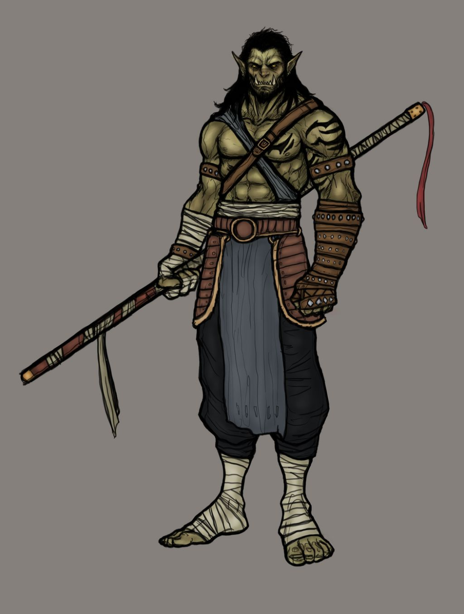
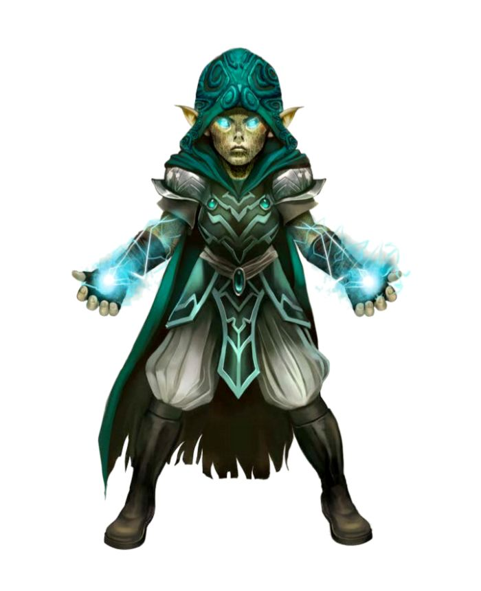
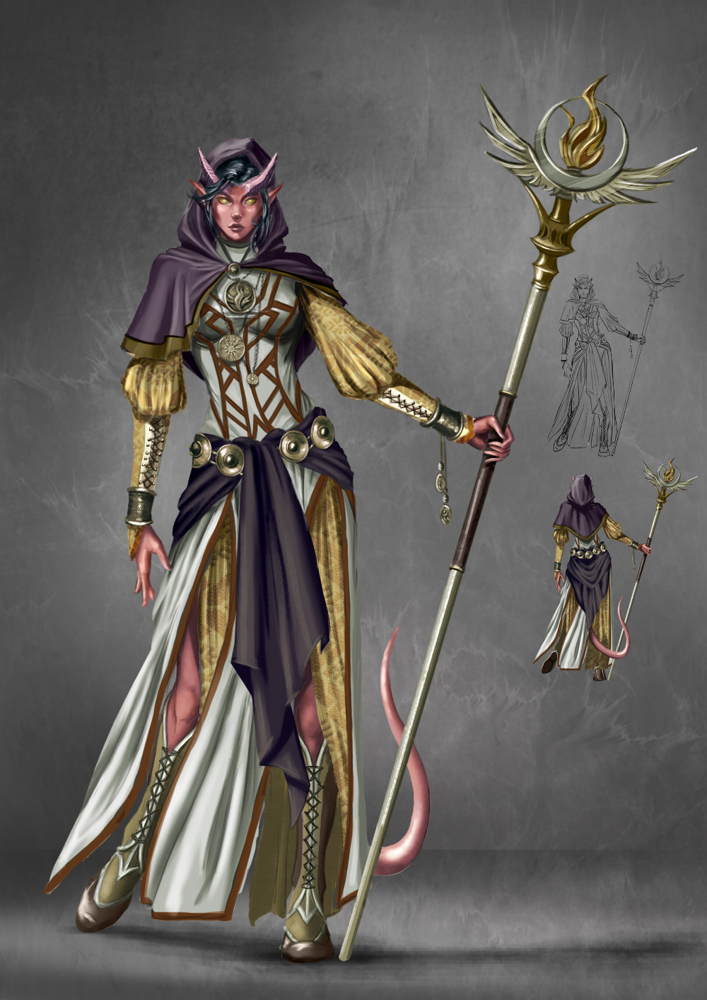

```{r setup, include=FALSE}
knitr::opts_chunk$set(echo = FALSE)


```
<br>
<details>
   <summary><span style="color:red;font-size:24px;">Dragonborn +2 Str, +1 Cha</span></summary>
   
   

  As their name implies, dragonborn are of draconic descent and therefore have some side effects of that. These include a breath weapon as well as damage resistance determined by the bloodline from which they've come.
  
  -----
  
  A dragonborn would make an excellent Fighter, Sorceror of a draconic bloodline, or perhaps an even better Cleric of the Tempest or War domain!"

  
-----
</details>
<br>
<details>
   <summary><span style="color:brown;font-size:24px;">Dwarf +2 Con</span></summary>
   
   
   
   <span style="color:brown;">Hill Dwarf +1 Wis</span><br>
   <span style="color:brown;">Mountain Dwarf +2 Str</span>

   Dwarves live mostly underground and as such have Darkvision. They are a stout people which gives you resistance to poison damage and advantage on saving throws against being poisoned!
   
   Hill Dwarves are generally a calmer wiser version of their mountain brothers! They also gain 1 extra hitpoint per level!
   
   Mountain Dwarves are strong, stout, and ready for war! They are the strongest among the dwarves and gain proficiency with light and medium armor! 
  
  -----
  
  Dwarves are extremely sturdy and make good tanks! A Barbarian, Paladin, or Fighter wouldn't be out of their comfort zone! Or maybe a Cleric of the War domain!

  
-----
</details>
<br>
<details>
   <summary><span style="color:green;font-size:24px;"> Elf +2 Dex        </span></summary>
   
   
   <span style="color:gold;"> High Elf +1 Int </span><br>
   <span style="color:green;"> Wood Elf +1 Wis </span><br>
   <span style="color:purple;"> Dark Elf (Drow) +1 Cha </span>

   Elves are the most elegant and graceful of the races! They are accustomed to dimly lit forests and the night and as such also posses Darkvision! They are a highly observant and cautious people, which grants them proficiency in Perception! Elves are also of fae descent and as such have advantage against being charmed and cannot be put to sleep by magic. When they do choose to "sleep" they enter into a deep meditative trance which they only need maintain for 4 hours to garner the benefits of a long rest.
   
   High Elves value erudition and as such have greater intelligence than average elves. They all learn one cantrip from the wizard's spellbook. Int is the spellcasting ability for this cantrip. Their love of knowledge extends to other cultures as well, as such they are required to be multi-lingual. You may choose one extra language to speak, read, and write.
   
   Wood elves dwell in the woods among the beasts and wild flora! They pride themselves on their intuition! They are wiser than the average elf. Swift as a peregrine in flight are the wood elves! They gain +5 feet to their walking speed. They are also adept at blending in with nature if they are even lightly obscured by foliage, rain, snow, mist, or other natural phenomena then they may attempt to hide.
   
   Dark elves are often considered to be evil and though they are not necessarily so, the reason that they are so uncommon is because their kind was banished from among the other elves for supporting an evil goddess! They now live in the Underdark. This gives them superior darkvision, allowing them to see twice as far in the dark as normal creatures. However having such keen vision can be a disadvantage when on the surface! Drow suffer disadvantage on Perception and attack rolls when they or their target are in direct sunlight.
   All drow practice light related magic, at 1st level they all know dancing lights, at 3rd you gain faerie fire, at 5th darkness!
  
  -----
  
  Elves are graceful and swift! Excellent as Rogues, Druids, or Rangers! Also would make an excellent Cleric of the Light or Life domain
  
-----
</details>
<br>
<details>
  <summary><span style="color:blue;font-size:24px;"> Gnome +2 Int </span></summary>
  
  
  
  <span style="color:green;"> Forest Gnome +1 Dex </span><br>
  <span style="color:gray;"> Rock Gnome +1 Con </span>
  
  Gnomes, like dwarves are accustomed to life underground and as such possessblog    the gift of darkvision! They ar also incredibly cunning which grants them advantage on any Int, Wis, or Cha saving throw vs magic
  
  Forest Gnomes are adept at trickery and remaining hidden! They all learn the cantrip minor illusion as children. Int is the spellcasting ability for this cantrip
  
  Rock Gnomes are hardier and even more inventive than other gnomes! They are naturally proficient with tinkerer's tools and can build small clockwork contraptions in the blink of an eye! Most keep at least one construct on them at all times!
  
  -----
  
  Gnomes are notoriously wily, Their small size also makes them somewhat inclined towards stealth! Gnomes could make good Wizards, Rogues, Sorcerors, or Clerics of the Trickery domain!
  
-----
</details>
<br>
<details>
  <summary><span style="color:silver;font-size:24px;"> Half-Elf +2 Cha </span></summary>
  
  
  
  Two of your skills other than charisma increase by one
  
  Half-elves posses the darkvision of their elven ancestors as well as their resistance to some magic! They have advantage against being charmed and cannot be put to sleep by magic! They do however (*unlike the elven halves*) require normal sleep for the full 8 hours!
  
  -----
  
  
  Half-elves are excellent diplomats given that they posses the grace and beauty of the elves as well as the energy and optimistic outlook of humans! They could make good warlocks, sorcerors, bards, and also excellent Clerics of the Life or Trickery domain!
  
-----
</details>
<br>
<details>
  <summary><span style="color:black;font-size:24px;"> Half-Orc +2 Str, +1 Con </span></summary>
  
  
  
  Half Orcs are fearsome creatures! They are stronger and generally sturdier than any human could ever be! They are also Larger both vertically as well as just pure bulk! They have darkvision due to their orc blood. They gain proficiency in Intimidation! They are incredibly hardy and stubborn! So much so that when someone strikes a blow that should kill them, they refuse to be knocked unconscious, and rather are reduced to 1 hit point! In return for their incredible resilience they are also savage warriors! When they land a critical strike with a melee weapon, you can roll an additional damage die and add that to the total!
  
  -----
  
  Half-Orcs are built stronger than humans and are nearly as intelligent but due to their Orcish kinship are often looked down upon! Despite this they make stalwart allies once their trust is earned! They make excellent Fighters, Barbarians, and Paladins! They can even be good Monks and Bards, another excellent positions for them is the clergy! Likely in the Tempest or War domain!
  
-----
</details>
<br>
<details>
  <summary><span style="color:DarkGoldenRod;font-size:24px;"> Halfling +2 Dex </span></summary>
  
  
  
  <span style="color:DarkGoldenRod;"> Lightfoot Halfling +1 Cha </span><br>
  <span style="color:DarkGoldenRod;"> Stout Halfling +1 Con </span>
  
  Halfings are so small and nimble that they can move through the same space as any creature larger than themselves! They are also smiled upon by the gawds, when e'er they fumble a d20 roll they may reroll! They are quit ebrace despite being small and mostly leading calm, quiet lives. They have advantage against being frightened!
  
  Lightfoot Halfings are even more sneaky than most and can attempt to hide even when only obscured by a creature that is one size larger than them!
  
  Stout Halflings are aptly named as they are hardier than average! They have advantage when rolling against poison and resistance to poison damage!
  
  -----
  
  Halflings are good and kind! They are quite dexterous despite the fact that they'd never claim to be so! Due to their size and alacrity they are often excellent rogues but at times when they are truly an adventurous fellow they have even been known to become monks, or barbarians! They too would fit in well among the clergy! The Trickery domain would be privileged to have such a member!
  
-----
</details>
<br>
<details>
  <summary><span style="color:bronze;font-size:24px;"> Human +1 All </span></summary>
  
  
  
  All of your stats increase by one.
  
  -----
  
  Humans are well rounded creatures! Not excelling anywhere but seldom very deficient! Why anyone would choose such a race I may never know! They make average students of any class.
  
-----
</details>
<br>
<details>
  <summary><span style="color:purple;font-size:24px;"> Tiefling +2 Cha, +1 Int </span></summary>
  
  
  
  And finally the Tiefling! They posses darkvision due to their demonic ancestry as well as resistance to fire damage! Along with these two side effects, they also gain some innate spellcasting abilities! All tieflings can cast Thaumaturgy as a cantrip Charisma is their spellcasting ability. At 3rd level they are able to cast Hellish Rebuke as a 2nd level spell once per long rest, and at 5th level they can cast Darkness once per long rest!
  
  They can also speak Infernal!
  
  -----
  
  In similar manner to the Half-Orcs they are looked down upon for their ancestry. This has made them a somewhat divided race, many of their number feels that the prejudices of the other races deserve punishment and so they become hateful towards the other races, falling inline with their demonic bloodline and reaffirming the suspicions most people have of Tieflings! These types have been known to pursue the Oath of Vengeance in the way of a paladin. However there are some who strive, through kindness and charisma to improve the standing of their kind in the eyes of the other races! These often make excellent Bards, Rogues, or sorcerors! Excellent candidates for the Trickery, or Light domains of the clergy!
  
-----
</details>


```{r CreateDataFrame}

Race <- c("Dragonborn", "Dwarf", "Elf", "Gnome", "Half-Elf", "Half-Orc", "Halfling", "Human", "Tiefling")

Subraces <- c("", "Hill Dwarf +1 Wis, Mountain Dwarf +2 Str", "High Elf +1 Int, Wood Elf +1 Wis, Dark Elf +1 Cha", "Forest Gnome +1 Dex, Rock Gnome +1 Con", "", "", "Lightfoot Halfling +1 Cha, Stout Halfling +1 Con", "", "")

Str <- c(2, 0, 0, 0, 0, 2, 0, 1, 0)

Dex <- c(0, 0, 2, 0, 0, 0, 2, 1, 0)

Con <- c(0, 2, 0, 0, 0, 1, 0, 1, 0)

Int <- c(0, 0, 0, 2, 0, 0, 0, 1, 1)

Wis <- c(0, 0, 0, 0, 0, 0, 0, 1, 0)

Cha <- c(1, 0, 0, 0, 2, 0, 0, 1, 2)

Extra <- c("As their name implies, dragonborn are of draconic descent and therefore have some benefits from that. These include a breath weapon as well as damage resistance determined by the bloodline from which you've come.", "Dwarves live mostly underground and as such have Darkvision. They are a stout people which gives you resistance to poison damage and advantage on saving throws against being poisoned!", "Elven kind", "", "Two of your skills other than Cha increase by one", "", "", "", "")

Assesment <- c("A dragonborn would make an excellent fighter, or perhaps an even better Cleric of the Tempest or War domain!", "Dwarves are extremely sturdy and make good tanks! A Barbarian perhaps? Or maybe a Cleric of the War domain!", "Elves are graceful and swift! Excellent as Rogues, Druids, or Rangers! Also would make an excellent Cleric of the Light or Life domain", "Gnomes are notoriously wiley, Their small size also makes them somewhat inclined towards stealth! Gnomes could make good Wizards, Rogues, Sorcerors, or Clerics of the Trickery domain!", "Half-elves are excellent diplomats given that they posses the grace and beauty of the elves as well as the energy and optimistic outlook of humans! They could make good warlocks, sorcerors, bards, and also excellent Clerics of the Life or Trickery domain!", "Half-orcs are built stronger than humans and are nearly as intelligent but due to their orcish kinship are often looked down upon! Despite this they make stalwart allies if their trust is earned! They make excellent Fighters, Barbarians, and Paladins! They can even be good Monks and Bards, another excellent positions for them is the clergy! Likely in the Tempest or War domain!", "halflings are good and kind! They are quite dextrous despite the fact that they'd never claim to be so! Due to their size and alacrity they are often excellent rogues but at times when they are truly an adventurous fellow they have even been known to beccome monks, or barbarians! They too would fit in well among the clergy! The Trickery domain would be priviledged to have such a member!", "Humans are well rounded creatures! Not excelling anywhere but seldom very deficient! Why anyone would choose such a race I may never know! They make average students of any class.", " And finally the Tiefling! In similar manner to the Orcs they are looked down upon for their ancestry. This has made them a somewhat divided race, many of their number feels that the predujices of the other races deserve punishment and so they become hateful towards the other races, falling inline with their demonic bloodline and reaffirming the suspicions most people have of Tieflings! These types have been known to pursue the Oath of Vengence in the way of a paladin. However there are some who strive, through kindness and charisma to improve the standing of their kind in the eyes of the other races! These often make excellent Bards, Rogues, or sorcerors! Excellent candidates for the Trickery, or Light domains of the clergy!")


Races <- data.frame(Race, Subraces, Str, Dex, Con, Int, Wis, Cha)

```
