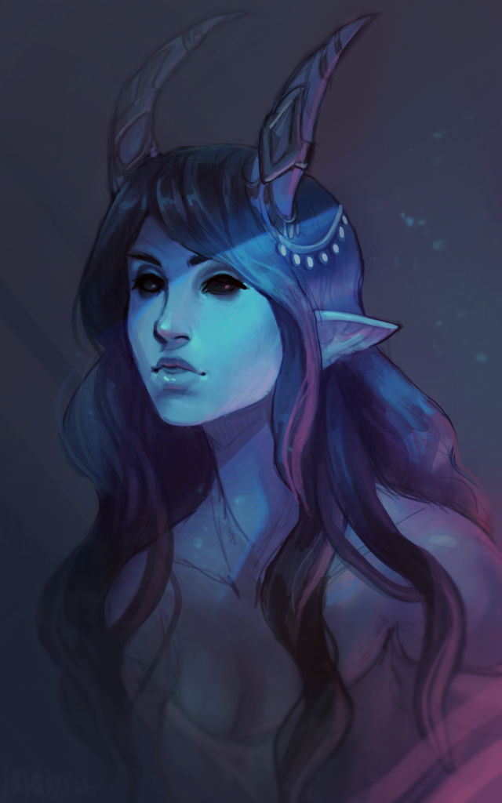
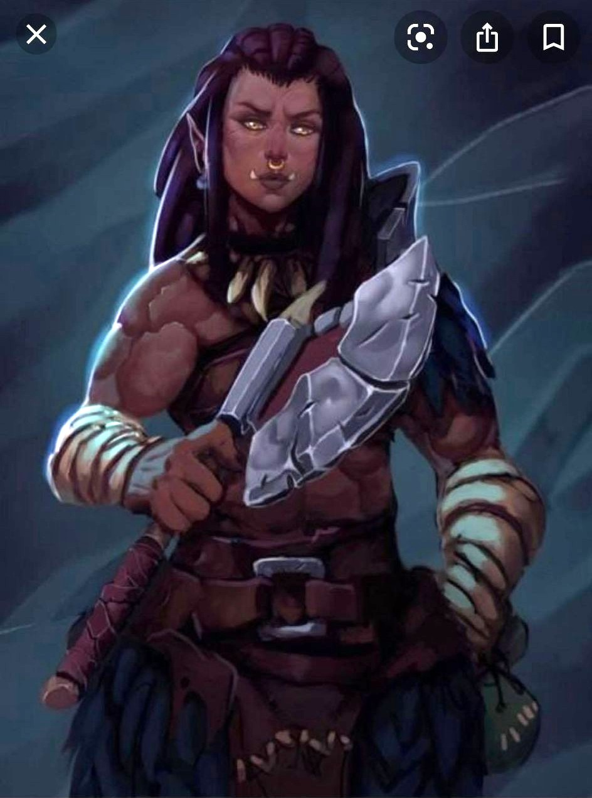
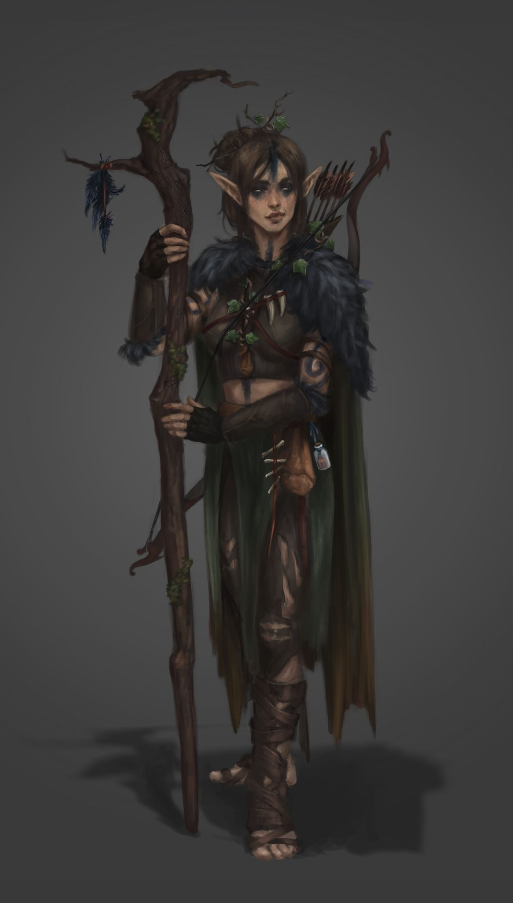
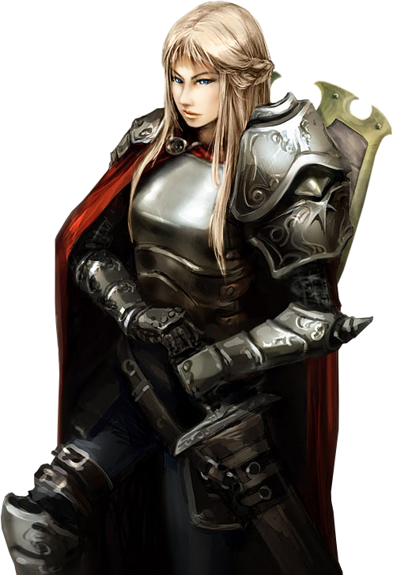
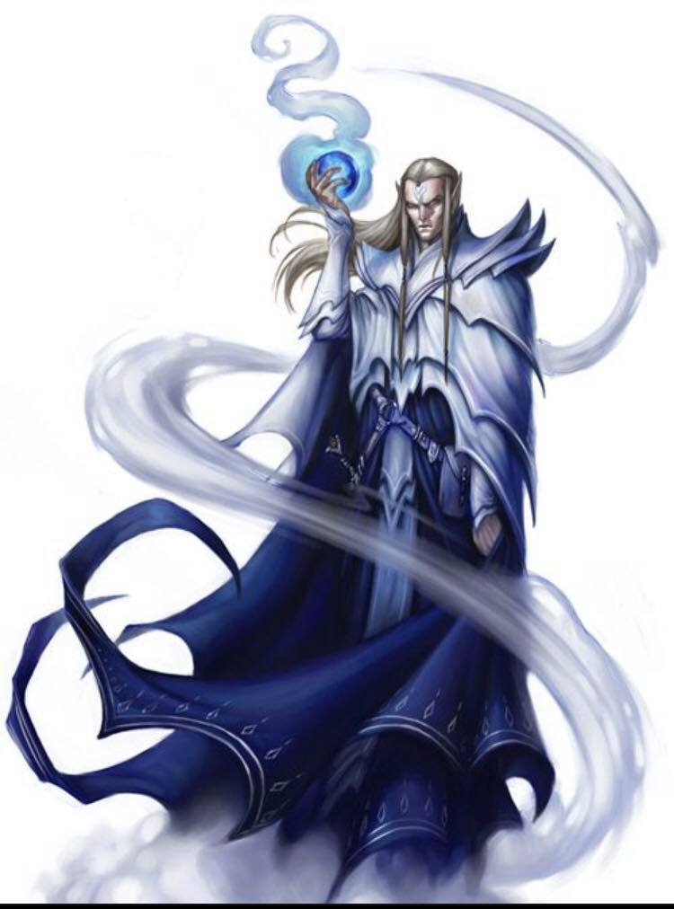
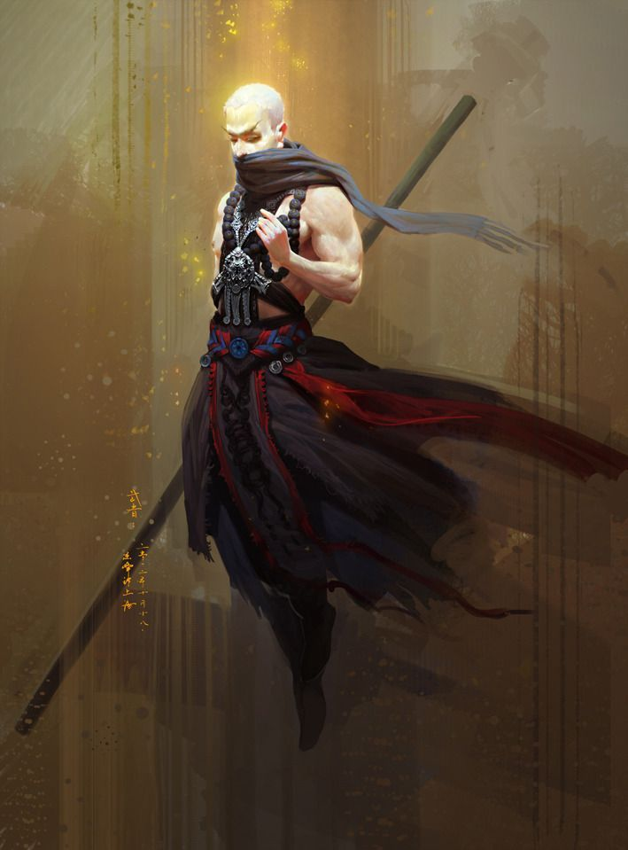
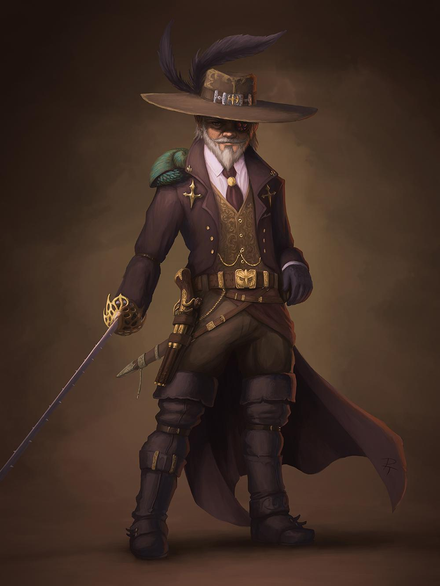

# For the 2021 Tyranny of Dragons we have 7 PCs, Miriam (*beautiful temptress!*), Ruby, Zia, Flame, Timothy (*likely not every game*), Isaiah, and Brighton! Brighton and Isaiah are new to the game!

-----

## Miriam:

Miriam is playing a Tiefling Wizard named Noel Frostine (Fros-tīne)!

-----

## Ruby:

Ruby is playing a Half-Orc fighter named Arizira (Ari-Seera)!

At the young age of 5 years old Arizara was taken from her orkish village in a battle between their clan and that of the humans. Arizara was than sold to a farm as a slave where she was branded and tortured she was forced to work there with no escape for years until she was 10 years old one night she saw a chance to escape and she never looked back she wandered alone and hungry for weeks. Until she stumbled upon a orkish village. The tribe was weary of her at first but she was accepted into the tribe, she quickly gained trust and respect from the others, and spent most her time dueling and practicing fighting techniques! By the age of 13 the clan went to battle with a human clan. She fought bravely and during these battles she earned 2 more scars but these add honor to her battle stories. Once she returned she was 16 years old she found life to be lacking in the village after the thrill of the war she would constantly go to near by villages looking for quests and fights to get into. After a while she decided to become a full blown adventurer and she gained a name for herself.

-----

## Zia:

Zia is playing a Wood-Elf Druid named Ynara (Yuh-nara) Ashfall!

Ynara is a soft-spoken and somewhat reclusive elf who is well into her third century. She marks her skin with darkened ashes as a sign of penance for her past mistakes. She empathizes deeply with others' sorrows and will often go to great lengths to try and alleviate them.

-----

## Flame:

Flame is playing a Human Paladin named Olphira!

-----

## Timothy:

Timothy may not be with use for every adventure but when he is, he will be playing a Djinn Barbarian named Zephyril Umbondjinnsen!

-----

## Isaiah:

Isaiah will be playing a Human MonkLock (*Multiclassing as Monk and Warlock*) named Jorn (Yorn)!

-----

## Brighton:

And finally, Brighton will be playing a Gnome Assassin named Kethic Stormgazer!

