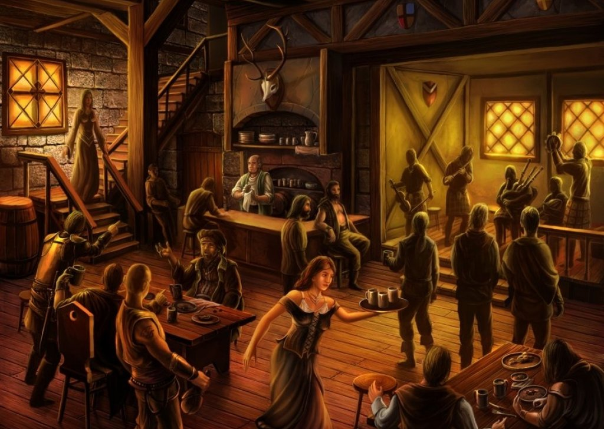

# All of our brave adventurers coalesce at the Plodding Pangolin Inn

This is a family run inn, the patriarch is a human man named Kopek. He and his wife, Adeena, have run the inn for many years! As their children grew, they also began helping. Their three sons, Ankar, Jahkup, and Kopek II, help manage the inn and when necessary act as bouncers! The two girls, Indell, and Valka help their mother with the cooking, cleaning, and other management of the inn!

-----

Over the years this inn has gone from a kindly family bed and breakfast to a hub for adventurers and those seeking adventurers, it is here where you would most likely find someone to help with your goblin, orc, or perhaps even...*Dragon* problem! Though the family doesn't always necessarily enjoy the *interesting* folk that this type of establishment can attract, they are willing to provide such a location for the benefit of the city (And the vastly increased business doesn't hurt either!)

It is here that you have all gathered for a drink to celebrate your successful adventures up to this point!

-----

## A man looking for help!

  A man approaches your table and introduces himself as Leosin Erlanthar, he says that he has been sent from a the city of Waterdeep where a council of the nearby rulers, influential people, and potentially employable adventurers will be meeting to discuss a matter **most** urgent!
  
  He asks if you are the mighty adventures of whom he has heard tales? Olphira the Holy and mighty paladin, Kethic the relentless and inescapable assassin, Ynara the compassionate and wary Druid, Noel the majestic and erudite wizard, Arizira the formidable and unyielding fighter, Zephyril the marvelous and magnanimous, and Jorn the mysterious and inscrutable Warlock Monk?

  He then hand you a parchment scroll and seems to continue his search for worthy adventurers!
  
  

    
*Parchment Scroll*

    
  

    
