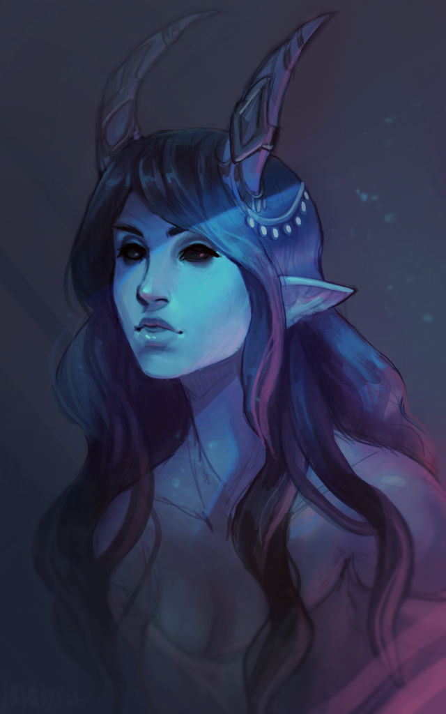
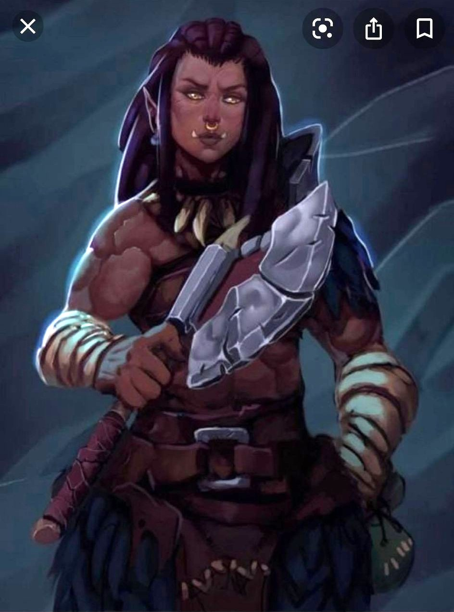
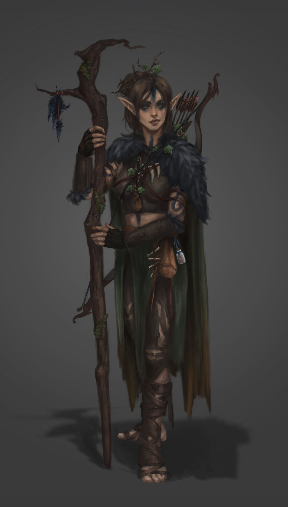
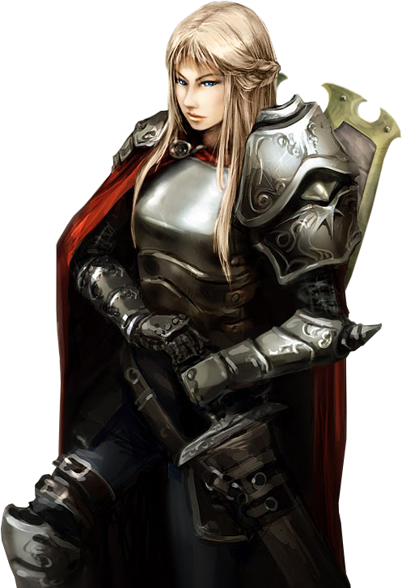
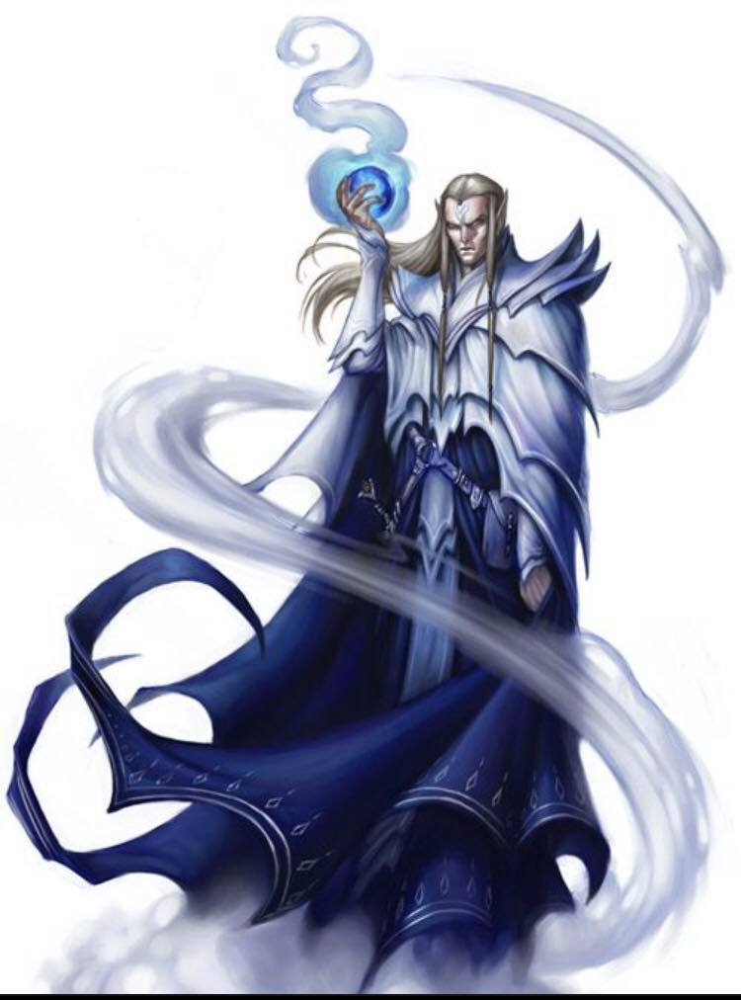
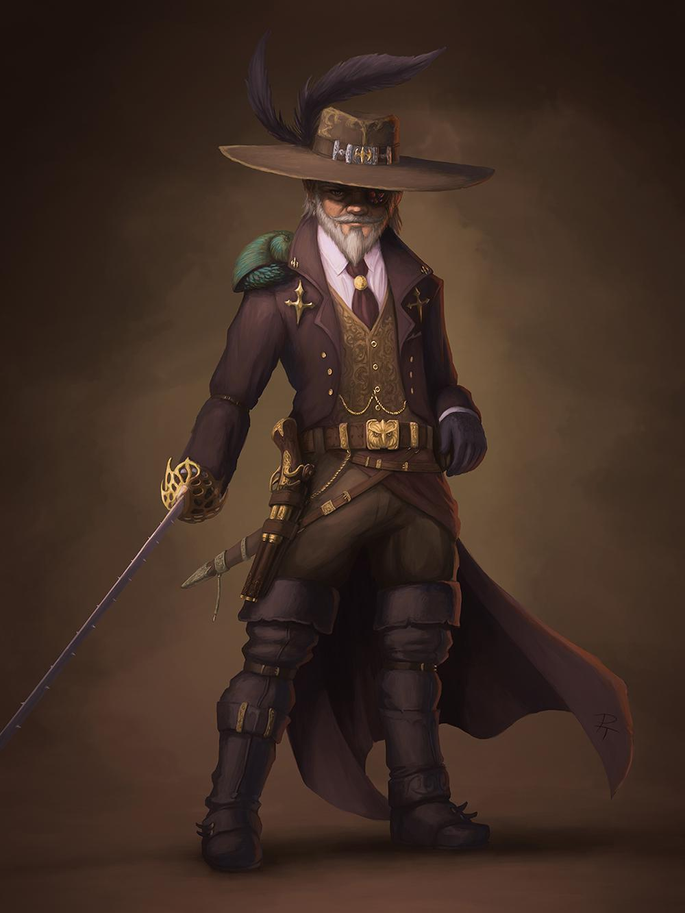

# For the 2021 Tyranny of Dragons we have 7 PCs, Miriam (*beautiful temptress!*), Ruby, Zia, Flame, Timothy (*likely not every game*), Isaiah, and Brighton! Brighton and Isaiah are new to the game!

## Miriam:

Miriam is playing a Tiefling Wizard named Noel Frostine (Fros-tīne)!

## Ruby:

Ruby is playing a Half-Orc fighter named Arizira (Ari-Seera)!

## Zia:

Zia is playing a Wood-Elf Druid named Ynara (Yuh-nara)!

## Flame:

Flame is playing a Human Paladin named Olphira!

## Timothy:

Timothy may not be with use for every adventure but when he is, he will be playing a Djinn named Zephyril Umbondjinnsen!

## Isaiah:

Isaiah will be playing a Human MonkLock (*Multiclassing as Monk and Warlock*) named Jorn (Yorn)!

<!---->

## Brighton:

And finally, Brighton will be playing a Gnome Assassin named Kethic Stormgazer!

